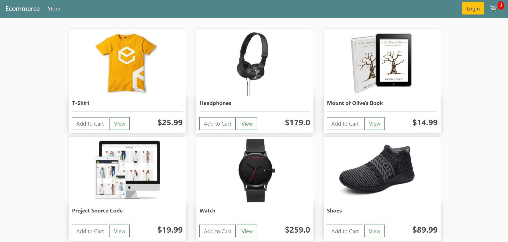
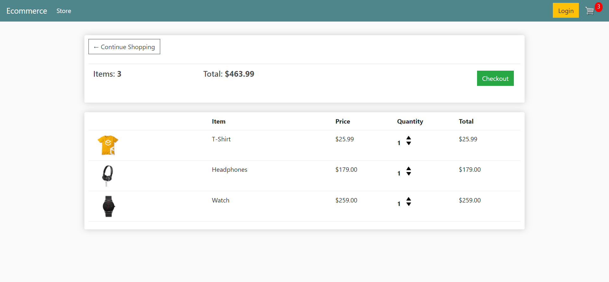
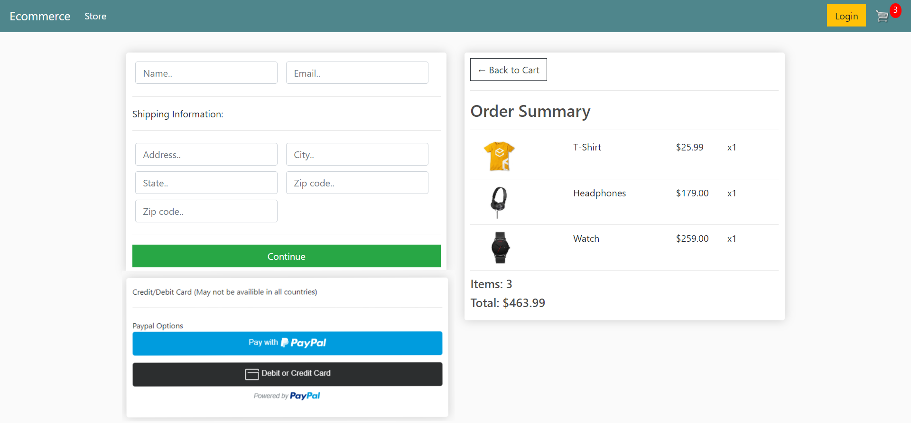

# Welcome to E-cart! ✨
E-cart is an online platform to order products online. The user can pay through PayPal, Debit/Credit card or Net Banking methods.  
<h2>Features and Functionalities 😃</h2>

<strong>User features</strong>

<ul>
<li>User sign up and login</li>
<li>Search for Products items</li>
<li>Save Cart</li>
<li>Delete Cart</li>
<li>Payment Methods - PayPal, Debit/Credit card, Net Banking)</li>
</ul>

<strong>Admin features</strong>

<ul>
<li>Add new products</li>
<li>Delete products</li>
</ul>
<h2>Screenshots</h2>
<h3>Home Page</h3>

<h3>Checkout Page</h3>

<h3>Cart Page</h3>

<h2>Tech Stack 💻</h2>
<ul>
<li>Python Django</li>
<li>JavaScript</li>
<li>SQLite</li>
<li>HTML</li>
<li>CSS</li>
</ul>
<h2>API 👨‍💻</h2>
<ul>
<li><a href="https://developer.paypal.com/">PayPal API</a></li>
</ul>
